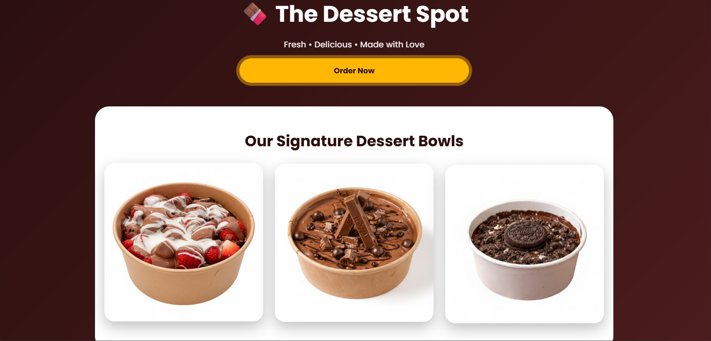
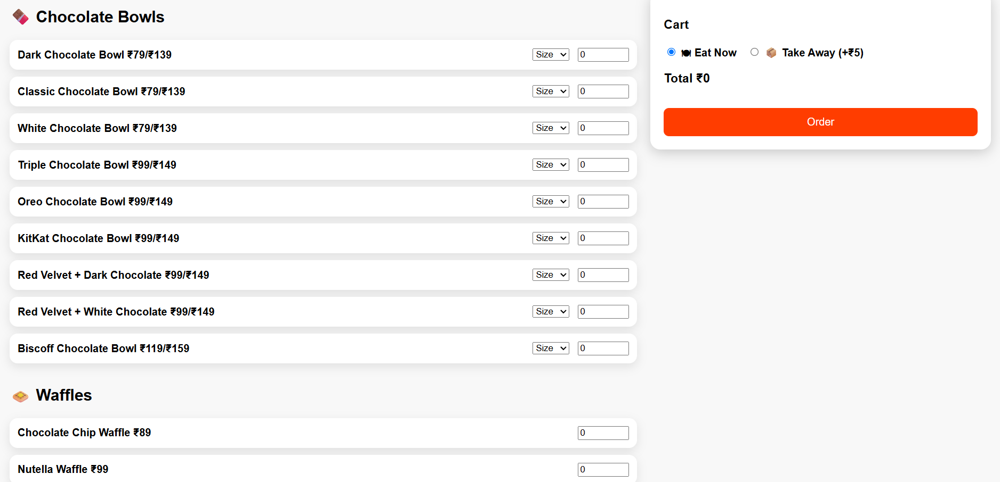
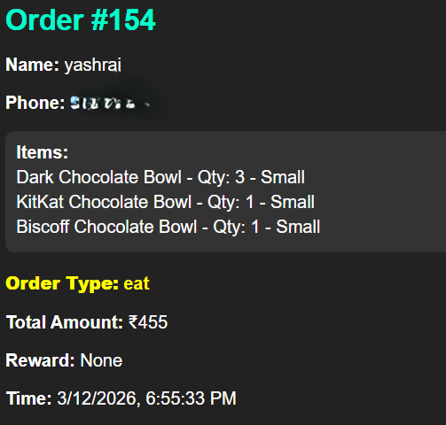

# 🍰 The Dessert Spot

A responsive dessert shop web application that allows customers to browse desserts, place orders, and provides an admin dashboard for managing products and customer orders.

---

## ✨ Features

- 🍩 Browse a variety of desserts
- 🛒 Place dessert orders online
- 👤 Customer ordering page
- 🔐 Admin dashboard
- 📦 Manage products
- 📋 View customer orders
- 📱 Responsive design
- 🎨 Interactive and user-friendly interface

---

## 🛠️ Technologies Used

- HTML5
- CSS3
- JavaScript
- Firebase 
- Responsive Web Design

---

## 📂 Project Structure

```
The-Dessert-Spot/
│── index.html
│── shop.html
│── customer.html
│── order.html
│── admin.html
│── style.css
│── order.css
│── script.js
│── order.js
│── spin.js
│── images/
│── README.md
```

---

## 🚀 Installation

1. Clone the repository

```bash
git clone https://github.com/yashraj1317/The-Dessert-Spot.git
```

2. Open the project folder.

3. Run **index.html** in your browser.

---

## 📸 Screenshots


### Shop Page



### Order Page



### Admin Dashboard



## 🔮 Future Enhancements

- Online payment integration
- User authentication
- Order history
- Product search and filters
- Customer reviews and ratings
- Inventory management

---

## 👨‍💻 Author

**Yashraj Sagar Shedage**

B.Sc. Computer Science | M.Sc. Data Science
